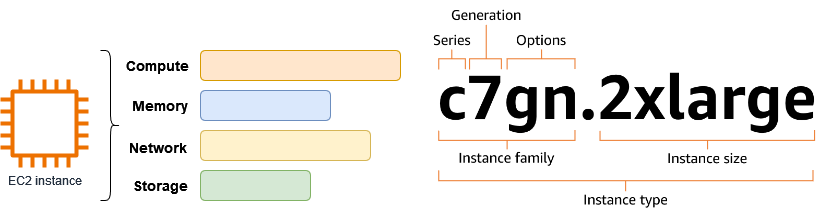

# [What is Amazon EC2?](https://docs.aws.amazon.com/AWSEC2/latest/UserGuide/concepts.html)
 
 Amazon Elastic Compute Cloud (Amazon EC2) provides on-demand, scalable computing capacity in the Amazon Web Services (AWS) Cloud. Using Amazon EC2 reduces hardware costs so you can develop and deploy applications faster. You can use Amazon EC2 to launch as many or as few virtual servers as you need, configure security and networking, and manage storage. You can add capacity (scale up) to handle compute-heavy tasks, such as monthly or yearly processes, or spikes in website traffic. When usage decreases, you can reduce capacity (scale down) again.

An EC2 instance is a virtual server in the AWS Cloud. When you launch an EC2 instance, the instance type that you specify determines the hardware available to your instance. Each instance type offers a different balance of compute, memory, network, and storage resources. [For more information,](https://docs.aws.amazon.com/ec2/latest/instancetypes/instance-types.html)

