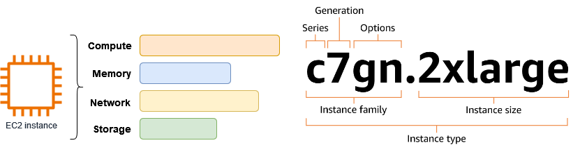
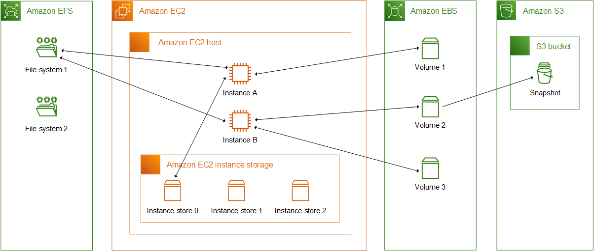
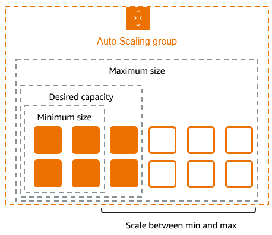
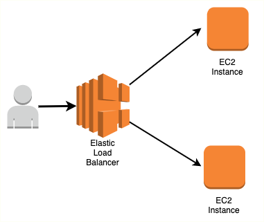
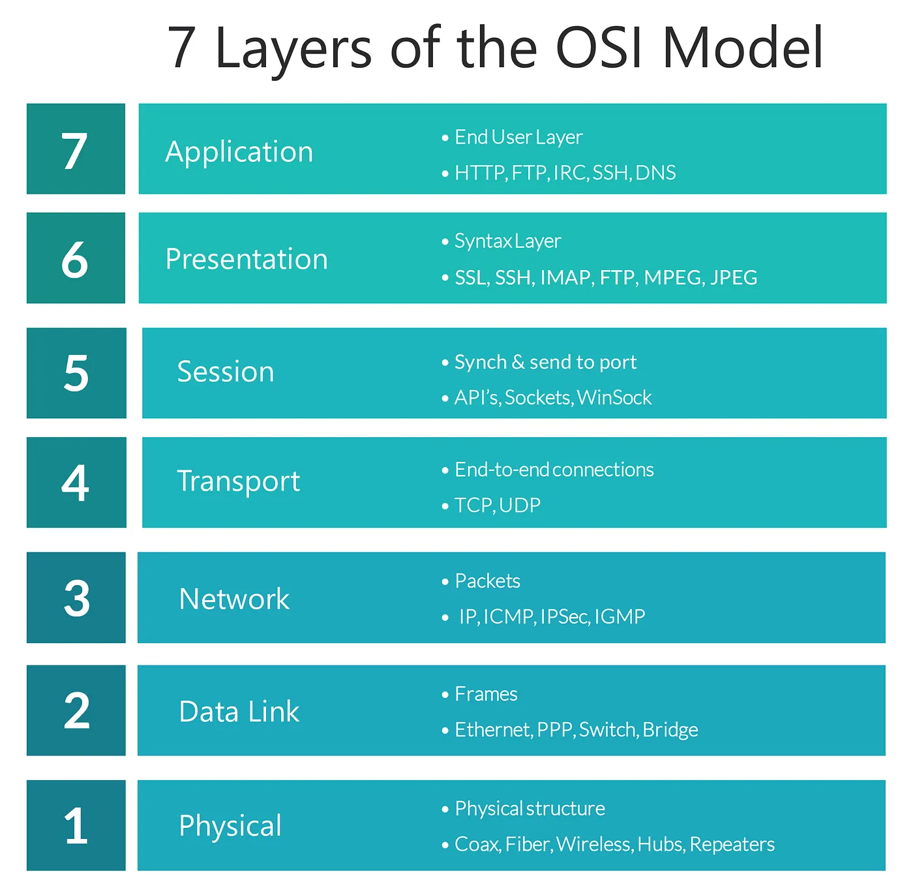
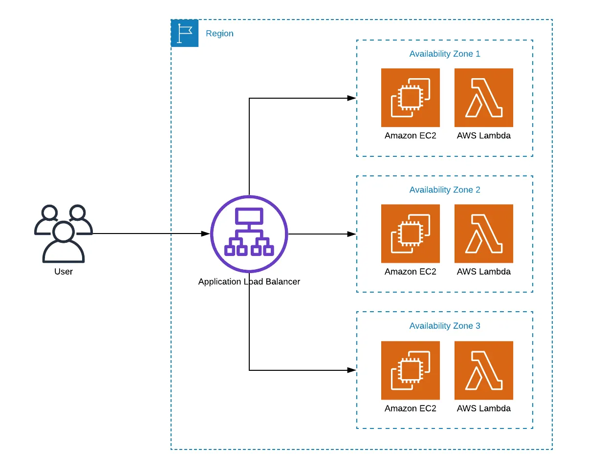
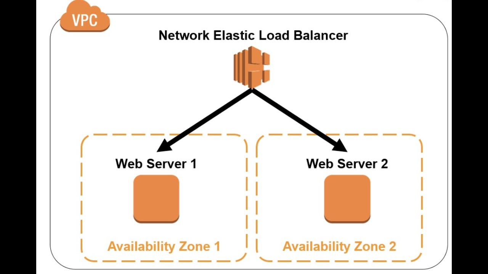

# [What is Amazon EC2?](https://docs.aws.amazon.com/AWSEC2/latest/UserGuide/concepts.html)
 
 Amazon Elastic Compute Cloud (Amazon EC2) provides on-demand, scalable computing capacity in the Amazon Web Services (AWS) Cloud. Using Amazon EC2 reduces hardware costs so you can develop and deploy applications faster. You can use Amazon EC2 to launch as many or as few virtual servers as you need, configure security and networking, and manage storage. You can add capacity (scale up) to handle compute-heavy tasks, such as monthly or yearly processes, or spikes in website traffic. When usage decreases, you can reduce capacity (scale down) again.

An EC2 instance is a virtual server in the AWS Cloud. When you launch an EC2 instance, the instance type that you specify determines the hardware available to your instance. Each instance type offers a different balance of compute, memory, network, and storage resources. [For more information,](https://docs.aws.amazon.com/ec2/latest/instancetypes/instance-types.html)

# Features of Amazon EC2

Amazon EC2 provides the following high-level features:

**Instances**
Virtual servers.

**Amazon Machine Images (AMIs)**
Preconfigured templates for your instances that package the components you need for your server (including the operating system and additional software).

**Instance types**
Various configurations of CPU, memory, storage, networking capacity, and graphics hardware for your instances.

**General purpose:** M5 | M5a | M5ad | M5d | M5dn | M5n | M5zn | M6a | M6g | M6gd | M6i | M6id | M6idn | M6in | M7a | M7g | M7gd | M7i | M7i-flex | M8g | M8gd | Mac1 | Mac2 | Mac2-m1ultra | Mac2-m2 | Mac2-m2pro | T2 | T3 | T3a | T4g

**Compute optimized:** C5 | C5a | C5ad | C5d | C5n | C6a | C6g | C6gd | C6gn | C6i | C6id | C6in | C7a | C7g | C7gd | C7gn | C7i | C7i-flex | C8g | C8gd | C8gn

**Memory optimized:** R5 | R5a | R5ad | R5b | R5d | R5dn | R5n | R6a | R6g | R6gd | R6i | R6idn | R6in | R6id | R7a | R7g | R7gd | R7i | R7iz | R8g | R8gd | R8i | R8i-flex | U-3tb1 | U-6tb1 | U-9tb1 | U-12tb1 | U-18tb1 | U-24tb1 | U7i-6tb | U7i-8tb | U7i-12tb | U7in-16tb | U7in-24tb | U7in-32tb | U7inh-32tb | X1 | X1e | X2gd | X2idn | X2iedn | X2iezn | X8g | z1d

**Storage optimized:** D2 | D3 | D3en | H1 | I3 | I3en | I4g | I4i | I7i | I7ie | I8g | Im4gn | Is4gen

**Accelerated computing:** DL1 | DL2q | F1 | F2 | G4ad | G4dn | G5 | G5g | G6 | G6e | G6f | Gr6 | Gr6f | Inf1 | Inf2 | P3 | P3dn | P4d | P4de | P5 | P5e | P5en | P6-B200 | P6e-GB200 | Trn1 | Trn1n | Trn2 | Trn2u | VT1

**High-performance computing:** Hpc6a | Hpc6id | Hpc7a | Hpc7g

**Amazon EBS volumes**
Persistent storage volumes for your data using Amazon Elastic Block Store (Amazon EBS).

# Storage options for your Amazon EC2 instances
Amazon EC2 provides you with flexible, cost effective, and easy-to-use data storage options for your instances. Each option has a unique combination of performance and durability. These storage options can be used independently or in combination to suit your requirements.

**Block storage**

  - Amazon EBS

  - Instance store temporary block storage for EC2 instances

**Object storage**

  - Amazon S3

**File storage**

  - Amazon EFS

**Instance store volumes**

Storage volumes for temporary data that is deleted when you stop, hibernate, or terminate your instance.

**Key pairs**

Secure login information for your instances. AWS stores the public key and you store the private key in a secure place.

**Security groups**

A virtual firewall that allows you to specify the protocols, ports, and source IP ranges that can reach your instances, and the destination IP ranges to which your instances can connect.

# [Auto Scaling Documentation](https://docs.aws.amazon.com/autoscaling/)

AWS provides multiple services that you can use to scale your application. Auto scaling is enabled by Amazon CloudWatch and is available at no additional charge beyond the service fees for CloudWatch and the other AWS resources that you use.

# [What is Amazon EC2 Auto Scaling?](https://docs.aws.amazon.com/autoscaling/ec2/userguide/what-is-amazon-ec2-auto-scaling.html)

Amazon EC2 Auto Scaling helps you ensure that you have the correct number of Amazon EC2 instances available to handle the load for your application. You create collections of EC2 instances, called Auto Scaling groups. You can specify the minimum number of instances in each Auto Scaling group, and Amazon EC2 Auto Scaling ensures that your group never goes below this size. You can specify the maximum number of instances in each Auto Scaling group, and Amazon EC2 Auto Scaling ensures that your group never goes above this size. If you specify the desired capacity, either when you create the group or at any time thereafter, Amazon EC2 Auto Scaling ensures that your group has this many instances. If you specify scaling policies, then Amazon EC2 Auto Scaling can launch or terminate instances as demand on your application increases or decreases.

For example, the following Auto Scaling group has a minimum size of four instances, a desired capacity of six instances, and a maximum size of twelve instances. The scaling policies that you define adjust the number of instances, within your minimum and maximum number of instances, based on the criteria that you specify.

# Features of Amazon EC2 Auto Scaling

With Amazon EC2 Auto Scaling, your EC2 instances are organized into Auto Scaling groups so that they can be treated as a logical unit for the purposes of scaling and management. Auto Scaling groups use launch templates (or launch configurations) as configuration templates for their EC2 instances.

**Monitoring the health of running instances**
**Custom health checks**
**Balancing capacity across Availability Zones**
**Multiple instance types and purchase options**
**Automated replacement of Spot Instances**
**Load balancing**
**Scalability**
**Instance refresh**
**Lifecycle hooks**
**Support for stateful workloads**

[Amazon EBS snapshots](https://docs.aws.amazon.com/ebs/latest/userguide/ebs-snapshots.html)
You can back up the data on your Amazon EBS volumes by making point-in-time copies, known as Amazon EBS snapshots. A snapshot is an incremental backup, which means that we save only the blocks on the volume that have changed since the most recent snapshot. This minimizes the time required to create the snapshot and saves on storage costs by not duplicating data.

**Important**

AWS does not automatically back up the data stored on your EBS volumes. For data resiliency and disaster recovery, it is your responsibility to create EBS snapshots on a regular basis, or to set up automatic snapshot creation by using Automate backups with Amazon Data Lifecycle Manager or AWS Backup.

Snapshots are stored in Amazon S3, in S3 buckets that you can't access directly. You can create and manage your snapshots using the Amazon EC2 console or the Amazon EC2 API. You can't access your snapshots using the Amazon S3 console or the Amazon S3 API.

Snapshot data is automatically replicated across all Availability Zones in the Region. This provides high availability and durability for snapshot data, and enables you to restore volumes in any Availability Zones in that Region.

Each snapshot contains all of the information that is needed to restore your data (from the moment when the snapshot was taken) to a new EBS volume. When you create an EBS volume from a snapshot, the new volume begins as an exact replica of the volume that was used to create the snapshot.

# Elastic Load Balancer (ELB)
Elastic Load Balancing automatically distributes your incoming traffic across multiple targets, such as EC2 instances, containers, and IP addresses, in one or more Availability Zones. It monitors the health of its registered targets, and routes traffic only to the healthy targets. Elastic Load Balancing scales your load balancer capacity automatically in response to changes in incoming traffic.

# Load balancer benefits
Elastic Load Balancing (ELB) is a service provided by Amazon Web Services (AWS) that automatically distributes incoming application traffic across multiple targets—such as Amazon EC2 instances, containers, IP addresses, and Lambda functions—in one or more Availability Zones (AZs).

ELB improves fault tolerance, availability, and scalability of applications by balancing the load and ensuring no single server bears too much traffic.

# [Types of Elastic Load Balancers in AWS](https://aws.amazon.com/elasticloadbalancing/features/)

There are four main types of Elastic Load Balancers:

**1. Application Load Balancer (ALB)**

Layer: 7 (Application Layer - HTTP/HTTPS)
Use Case: Web applications, microservices, and containerized applications (e.g., ECS/EKS)

Features:

- Path-based routing (e.g., /api/* → service A, /images/* → service B)
- Host-based routing (e.g., app.example.com → service A)
- Supports WebSockets and HTTP/2
- Native integration with ECS (Docker containers)
- SSL offloading
- URL rewriting and redirects
- Authentication (Cognito or OIDC)
# OSI Layers

# Application Load Balancer

**2. Network Load Balancer (NLB)**

Layer: 4 (Transport Layer - TCP, UDP, TLS)
Use Case: High-performance applications needing ultra-low latency and high throughput

Features:

- Handles millions of requests per second
- Extremely fast, optimized for sudden traffic spikes
- Preserves client IP
- TLS termination
- Static IP or Elastic IP
- Operates at the connection level

**3. Gateway Load Balancer (GWLB)**

Layer: 3/4 (Network Layer)
Use Case: For deploying, scaling, and managing third-party virtual appliances like firewalls, intrusion detection, etc.

Features:

- Integrates with AWS Firewall and other appliances
- Transparent traffic inspection
- Supports GENEVE encapsulation
- Combines with VPC Traffic Mirroring for advanced monitoring/security

**4. Classic Load Balancer (CLB)**

Layer: 4 & 7 (Legacy)
Use Case: Applications built within the EC2-Classic network (deprecated in new setups)

Features:

- Basic load balancing for HTTP/HTTPS and TCP
- Limited compared to ALB/NLB
- AWS recommends migrating to ALB or NLB

# AWS Security Best Practices

## 1. EC2 Basics – Best Practices

### Security
- Use **IAM roles** instead of hardcoding credentials inside EC2.
- Restrict **SSH access** using Security Groups (only allow trusted IPs).
- Use **EC2 Instance Connect** or key pair authentication for secure access.
- Disable root SSH access and enforce key-based authentication.

### Cost Optimization
- Right-size instances based on actual usage metrics.
- Use **Spot Instances** for stateless or non-critical workloads.
- Schedule **start/stop** for development and testing environments.
- Leverage **Reserved Instances** or **Savings Plans** for predictable usage.

### Availability & Resilience
- Deploy instances across multiple **Availability Zones**.
- Use **Auto Scaling Groups** for self-healing infrastructure.
- Monitor instances with **CloudWatch alarms** and automate actions.

### Performance
- Select appropriate **instance families** based on workload type.
- Use **Enhanced Networking (ENA)** for high throughput and low latency.

---

## 2. EBS Volumes & Snapshots – Best Practices

### Data Protection
- Enable **encryption** at rest using AWS KMS.
- Take **regular snapshots** for backup and recovery.
- Use **cross-region snapshots** for disaster recovery needs.

### Performance
- Use **Provisioned IOPS (io2/io1)** volumes for high-performance needs.
- Choose the right volume type for the workload (e.g., gp3, st1, sc1).

### Cost Management
- **Delete unused snapshots** regularly.
- Use **Amazon Data Lifecycle Manager** to automate snapshot creation and retention.
- Avoid over-provisioning volume size and IOPS.

### Operational Efficiency
- Tag volumes and snapshots for identification, cost tracking, and automation.
- Monitor EBS performance using **CloudWatch** metrics.

---

## 3. Elastic Load Balancer (ELB) – Best Practices

### Security
- Use **HTTPS listeners** with valid **SSL certificates** from ACM.
- Limit access with **security groups** scoped to required ports and IPs.
- Enable **Access Logs** for traffic auditing and analysis.

### High Availability
- Register targets in **multiple Availability Zones**.
- Use **health checks** to remove unhealthy instances automatically.
- Enable **cross-zone load balancing** for even traffic distribution.

### Performance
- Choose the correct ELB type based on use case:
  - ALB for Layer 7 (HTTP/HTTPS)
  - NLB for Layer 4 (TCP/UDP)
- Optimize **deregistration delay** to minimize disruptions during scale-in.

### Monitoring & Logging
- Enable **CloudWatch metrics** and set alarms.
- Use **AWS WAF** with ALB to protect web apps from common attacks (e.g., SQL injection).

---

## 4. Auto Scaling Basics – Best Practices

### Scaling Configuration
- Use **Target Tracking Policies** for automated, metric-driven scaling.
- Apply **Step Scaling** for more control over scaling thresholds.
- Use **Scheduled Scaling** to prepare for known demand patterns.

### Launch Templates
- Use **Launch Templates** (not older Launch Configs) for version control and flexibility.
- Reference the latest **secure and optimized AMIs**.

### Health & Recovery
- Enable both **EC2 and ELB health checks**.
- Use **lifecycle hooks** to run scripts during instance launch or termination.
- Configure **termination policies** to prevent removal of important instances.

### Distribution & Availability
- Deploy instances across multiple **Availability Zones**.
- Pair Auto Scaling with **ELB** for automatic traffic distribution to healthy instances.

### Monitoring
- Monitor key metrics like:
  - `GroupDesiredCapacity`
  - `GroupInServiceInstances`
  - `CPUUtilization`
  - `GroupMaxSize`
- Use **CloudWatch Alarms** to trigger notifications or scaling actions.

---

## References

- [Amazon EC2 Documentation](https://docs.aws.amazon.com/ec2/)
- [Amazon EBS Documentation](https://docs.aws.amazon.com/ebs/)
- [Elastic Load Balancing Documentation](https://docs.aws.amazon.com/elasticloadbalancing/)
- [Auto Scaling Documentation](https://docs.aws.amazon.com/autoscaling/)